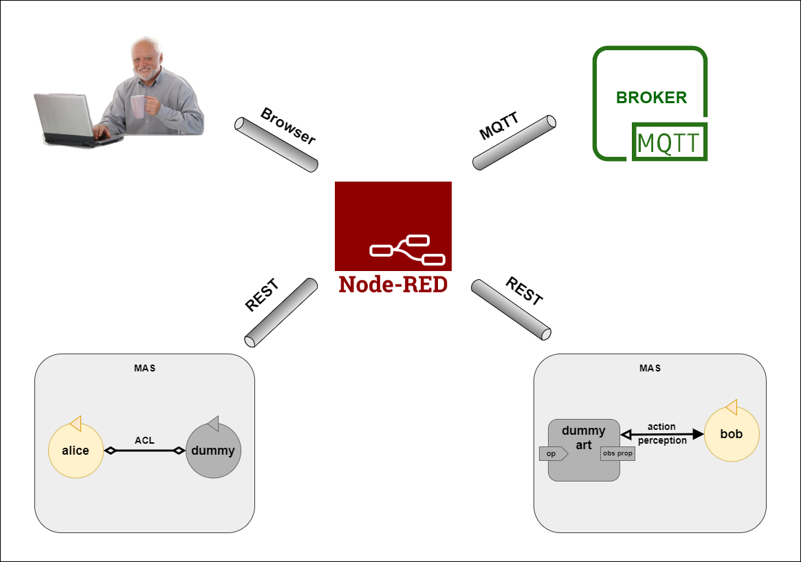

# JaCaMo-REST: Integration Demo (Node-RED + MQTT)
This demo presents an integration scenario where agents interact with external entities in a usual way, i.e., through ACL message and action/perception.

## Understanding the demo
The scenario consists of five entities:
* (2) JaCaMo applications (alice and bob)
* Node-RED application
* MQTT Broker
* User

An overview is below:


<!--  -->

In this scenario, the agents interact with an _MQTT broker_. [MQTT](http://mqtt.org/) is a lightweight protocol for messaging transport in a publish/subscribe pattern and an MQTT broker is a server that receives messages from clients (_publishers_) and routes them to the appropriate destinations (_subscribers_). MQTT users publish and/or subscribe to so-called _topics_. The table below summarizes the roles of both agents in this context:

| agent | publish to topic | subscribe to topic |
| :---: | :---: | :---: |
| alice | mqtt/jacamo/alice | mqtt/jacamo/bob |
| bob | mqtt/jacamo/bob | mqtt/jacamo/alice |

In this way, messages published by alice are delivered to bob and vice versa. Through a browser, you - _the User_ - can also publish to this topics. Further details are available [here](#guide).

A central entity to this scenario is the [Node-RED](https://nodered.org/), an integration tool that provides a browser-based editor to wire together hardware devices, APIs, and online services using a wide range of _nodes_. Here, it is responsible for integrating the MASs and the broker as well as including humans in the loop.

The connection between MAS and Node-RED occurs via _dummy entities_. They are jacamo-rest resources exclusively used to integrate the MAS and entities external to it. They can be of two types: __dummy agent__, for modeling an external entity as an agent; and __dummy artifact__, for modeling an external entity as an environment artifact.

The MQTT broker is differently modeled in the two MASs. On one hand, alice interacts with it as if it were another agent, i.e., via ACL message. On the other hand, the broker is an artifact for bob, who can execute its operations and perceive its signals and observable properties.

The connection between MAS and the external world occurs via ___dummy entities___. They are jacamo-rest entities exclusively used to integrate agents and entities external to the MAS. They can be of two types:
* __dummy agent__: used to model an external entity as an agent
* __dummy artifact__: used to model an external entity as an environment artifact


## Running with Gradle
#### Prerequisites:
- [Gradle](https://gradle.org/install/)


1) Make sure you are in the root directory of this project

2) Build docker image for JaCaMo:
```bash
# open a command-line shell and go to jacamo folder
$ cd jacamo
$ ./gradlew clean copyToLib # Windows: $ gradlew clean copyToLib
$ docker build -t jacamo-rest/demo/nodered .
```

## Running with Docker
#### Prerequisites:
- [Gradle](https://gradle.org/install/)
- [Docker](https://docs.docker.com/engine/install/)
- [Docker Compose *](https://docs.docker.com/compose/install/)
> \* On desktop systems like Docker Desktop for Mac and Windows, Docker Compose is included as part of those desktop installs.


1. Make sure you are in the root directory of this project

2. Build docker image for JaCaMo:
  ```bash
  # open a command-line shell and go to jacamo folder
  $ cd jacamo
  $ ./gradlew clean copyToLib # Windows: $ gradlew clean copyToLib
  $ docker build -t jacamo-rest/demo/nodered .
  ```
3. Launch JaCaMo applications and Node-RED flows via Docker Compose:
  ```bash
  # go back to the root directory and start the applications
  $ cd ..
  $ docker-compose -f docker-compose.yml -p jacamo-rest-demo-nodered up
  ```

## <a name="guide"></a>To try this sample
